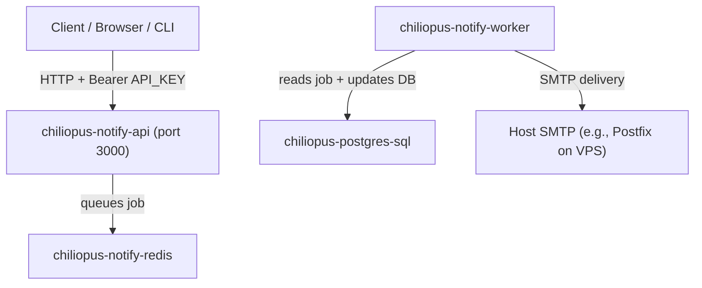

# Deploy Chiliopus Notify on CentOS (Docker / Compose)

This guide deploys the Chiliopus Notify microservice as Docker containers on a CentOS VPS, using the existing Docker files in this repo.

## Architecture (what runs where)

The docker compose setup runs these containers:

- `chiliopus-notify-api` (API + Swagger): serves `POST /notify/email` and status endpoints
- `chiliopus-notify-worker` (worker): consumes jobs from Redis and sends emails
- `chiliopus-notify-redis` (Redis): BullMQ queue backend
- `chiliopus-postgres-sql` (PostgreSQL): stores notifications + attempts (schema auto-initialized)

Note: Docker Compose also defines a compose “project name” (`name: chiliopus-platform`), which is why you may see `chiliopus-platform` in a Docker UI even though the runtime containers are the ones above.



## 0) Prerequisites on the CentOS VPS

- Docker Engine installed and running
- Docker Compose (plugin) available as `docker compose`
- Outbound SMTP connectivity to your configured SMTP server
- (Recommended) Open firewall for inbound API access to port `3000` (at least from your IP)

## 1) Prepare the `.env` used by Docker Compose

The compose file at [`docker/docker-compose.yml`](docker/docker-compose.yml) uses:

- `env_file: ../.env` for `API_KEY` and optional SMTP overrides

Because the compose file lives in `docker/`, the expected `.env` location is:

- `services/notify/.env` (relative to the repo root)

Create `services/notify/.env` with at minimum:

```env
API_KEY=YOUR_API_KEY_HERE
```

Optionally, for production where SMTP is provided by Postfix on the VPS host, set:

```env
SMTP_HOST=host.docker.internal
SMTP_PORT=25
SMTP_SECURE=false
SMTP_FROM=no-reply@yourdomain.com
SMTP_USER=
SMTP_PASS=
```

## 2) Start PostgreSQL (schema init happens automatically)

Start the PostgreSQL container first using:

```bash
docker compose -f docker/docker-compose.postgres.yml up -d
```

This will start:

- `chiliopus-postgres-sql`

and it mounts the schema:

- [`src/db/schema.sql`](src/db/schema.sql) into the Postgres init directory, so tables are created on first start.

Verify:

```bash
docker ps
docker logs chiliopus-postgres-sql --tail=100
```

## 3) Start Redis + Chiliopus Notify API + Worker

Now start the main stack:

```bash
docker compose -f docker/docker-compose.yml up -d --build
```

This will start:

- `chiliopus-notify-redis`
- `chiliopus-notify-api` (binds host port `3000:3000`)
- `chiliopus-notify-worker`

Verify they are running:

```bash
docker ps
docker logs chiliopus-notify-api --tail=100
docker logs chiliopus-notify-worker --tail=100
```

## 4) Verify API is reachable (Swagger + auth)

Swagger UI is available at:

- `http://<your-server-ip>:3000/api-docs`

Swagger JSON is available (public, no auth required):

- `http://<your-server-ip>:3000/api-docs.json`

All `/notify/*` and `/templates/*` API routes are protected by API key auth:

`Authorization: Bearer <API_KEY>`

### 4.1 Health/auth smoke check

Try a protected endpoint (templates requires auth):

```bash
curl -i http://<your-server-ip>:3000/templates \
  -H "Authorization: Bearer YOUR_API_KEY_HERE"
```

If you prefer, you can test the email queue endpoint in the next section.

## 5) Smoke test: Queue an email and check status

This service supports email sending via SMTP. The worker currently processes only the `email` channel.

### 5.1 Queue an email

Send a test email job:

```bash
curl -i -X POST http://<your-server-ip>:3000/notify/email \
  -H "Authorization: Bearer YOUR_API_KEY_HERE" \
  -H "Content-Type: application/json" \
  -d '{
    "to": "test-recipient@example.com",
    "subject": "Chiliopus Notify smoke test",
    "template": "welcome",
    "variables": {
      "name": "CentOS Tester"
    }
  }'
```

Expected response: HTTP `202` with JSON containing `jobId` (this is the notification id).

### 5.2 Check notification status

Replace `JOB_ID` with the value you got from the previous step:

```bash
curl -s http://<your-server-ip>:3000/notify/status/JOB_ID \
  -H "Authorization: Bearer YOUR_API_KEY_HERE" | jq
```

If you don’t have `jq` installed, remove `| jq`.

Look for:

- `status` becoming `sent` (or `failed` if SMTP delivery fails)
- `attempts` showing the delivery attempt history

If status stays `processing`/does not change, check the worker logs:

```bash
docker logs chiliopus-notify-worker --tail=200
```

## 6) Optional: Verify records directly in PostgreSQL

Enter `psql` inside the Postgres container:

```bash
docker exec -it chiliopus-postgres-sql psql -U postgres -d chiliopus
```

Then run:

```sql
SET search_path TO notify;
SELECT id, channel, recipient, status, created_at, sent_at
FROM notifications
ORDER BY created_at DESC
LIMIT 10;
```

Exit:

```sql
\q
```

## 7) Troubleshooting

### 7.1 `host.docker.internal` does not resolve on CentOS (Linux)

This repo uses `host.docker.internal` in `docker/docker-compose.yml` for `DATABASE_URL`, and you may also use it for `SMTP_HOST`.

If your containers cannot reach the host (DNS or connection errors), try the following approach:

- Run a quick DNS test from inside a container:

```bash
docker exec -it chiliopus-notify-api sh -c 'getent hosts host.docker.internal || nslookup host.docker.internal || true'
```

If resolution fails, apply the documented Docker Linux workaround: add `extra_hosts` with the `host-gateway` mapping.

Optional change (guide-only suggestion):

- Edit [`docker/docker-compose.yml`](docker/docker-compose.yml)
- Under `services.api` and `services.worker`, add:

```yaml
extra_hosts:
  - "host.docker.internal:host-gateway"
```

Then restart:

```bash
docker compose -f docker/docker-compose.yml down
docker compose -f docker/docker-compose.yml up -d --build
```

### 7.2 SMTP delivery fails (`failed` status)

Symptoms:

- notification status becomes `failed`
- worker logs contain SMTP/network errors

Check worker logs:

```bash
docker logs chiliopus-notify-worker --tail=300
```

Also verify your host SMTP service is reachable from the VPS (e.g., Postfix listening on `127.0.0.1:25` or `0.0.0.0:25`) and that firewall rules allow it.

### 7.3 API auth errors (HTTP `401 Unauthorized`)

Confirm you:

- set `API_KEY` in the VPS at `services/notify/.env`
- send requests with:
  `Authorization: Bearer <API_KEY>`

### 7.4 Worker not processing jobs

Check:

- `chiliopus-notify-worker` container is running (`docker ps`)
- Redis connectivity (worker logs)
- DB connectivity (worker logs include failures)

Worker logs:

```bash
docker logs chiliopus-notify-worker --tail=200
```

